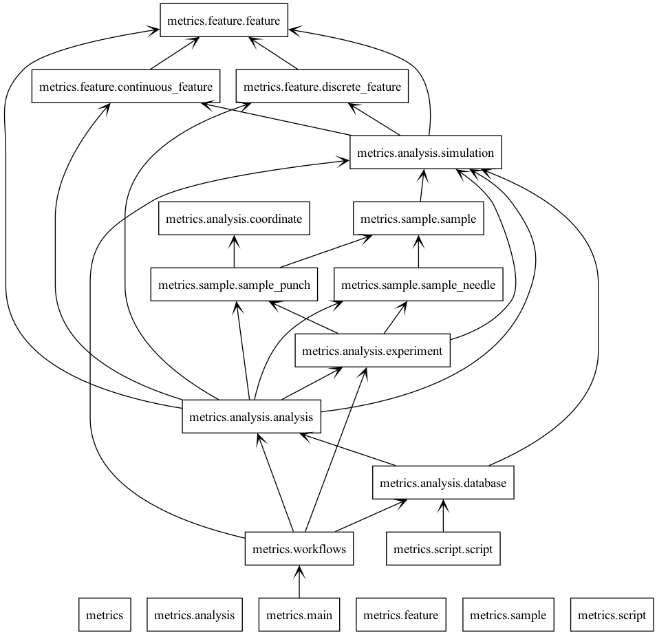

Welcome to METRICS's documentation!
========================================

.. automodule:: metrics.analysis
   :members:

.. automodule:: metrics.feature
   :members:

.. automodule:: metrics.sample
   :members:

.. automodule:: metrics.script
   :members:

.. toctree::
   :hidden:
   :maxdepth: 3
   :caption: Contents:

   Overview <self>
   Package modules <modules>

.. raw:: html

   
 See the pylint diagram for more information on <a href="_static/classes.png" target="_blank">classes</a> 

Indices and tables
==================

* :ref:`genindex`
* :ref:`modindex`
